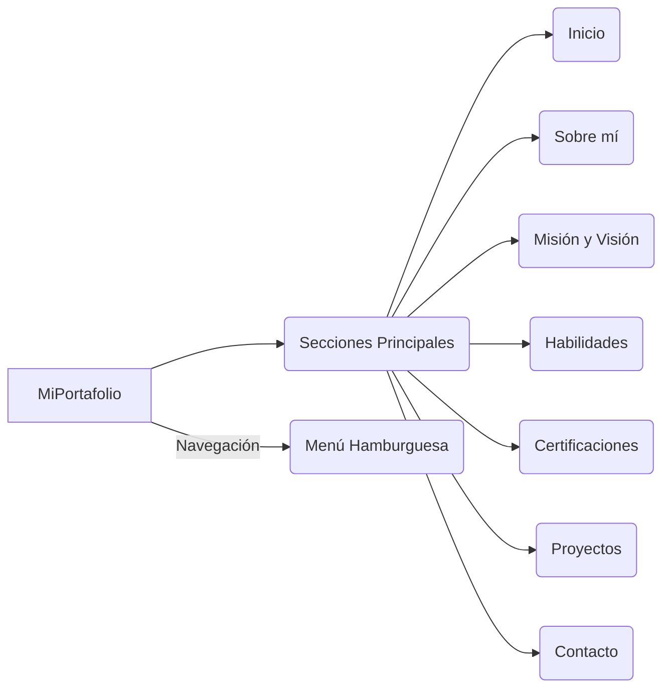

# Portafolio JC 🌐

## Tabla de Contenido
| Índice | Título  |
|--|--|
| 1. | [Descripción](#descripción-🚀) |
| 2. | [Características Principales](#características-principales-🧰) |
| 3. | [Tecnologías Utilizadas](#tecnologías-utilizadas-🛠️) |
| 4. | [Instrucciones de Ejecución](#instrucciones-de-ejecución-📂) |
| 5. | [Estructura](#estructura-📋) |

---

## Descripción 🚀

Este proyecto es una **página web personal** diseñada para mostrar información relevante sobre mi perfil profesional, habilidades y proyectos. La interfaz cuenta con un diseño limpio y profesional, con un menú de navegación funcional que se adapta a dispositivos móviles. 

---

## Características Principales 🧰

1. **Secciones Principales:**
   - **Inicio**: Presentación general y breve introducción.
   - **Sobre mí**: Resumen de mi trayectoria, valores y objetivos.
   - **Misión y Visión**: Mis objetivos y motivaciones personales.
   - **Habilidades**: Lista de tecnologías y herramientas que manejo.
   - **Certificaciones**: Logros y certificaciones relevantes.
   - **Proyectos**: Portafolio con ejemplos de trabajos realizados.
   - **Contacto**: Formulario para comunicación directa.

2. **Menú hamburguesa** 🍔:
   - Funcionalidad optimizada para dispositivos móviles.
   - Se cierra automáticamente al seleccionar una opción.

3. **Responsive Design** 📱:
   - Adaptación automática a diferentes tamaños de pantalla usando Bootstrap y CSS personalizado.

---

## Tecnologías Utilizadas 🛠️

- **HTML**: Base estructural de la página.
- **CSS**: Personalización de estilos para mejorar la apariencia.
- **JavaScript**: Implementación de interactividad, incluyendo el menú hamburguesa.
- **Bootstrap**: Facilitación de un diseño responsivo y moderno.

---

## Instrucciones de Ejecución 📂

Para ejecutar este proyecto localmente:

1. Clona este repositorio:
   ```bash
   git clone https://github.com/juanconde025/Portafolio-JC.git
   ```
2. Navega al directorio del proyecto: 
   ```bash
   cd Portafolio-JC
   ```
3. Abre el archivo **index.html** en tu navegador preferido.

O accede al proyecto en línea mediante el siguiente enlace: https://juanconde.netlify.app/

---

## Estructura 📋

